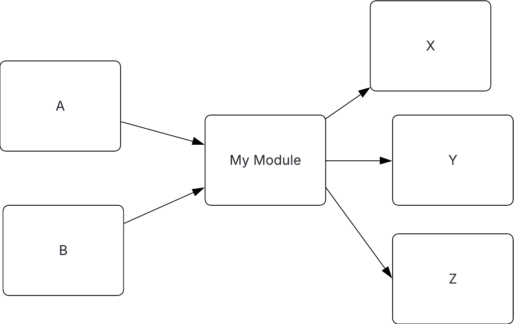

# Abstractness, Instability and the 'Main sequence'

Back way-back-when Uncle Bob's book Clean Architecture described a set of 2 metrics and a sequence about how modules are comprised and how they interact. I have seen lots of literature about how this applies to Java, Python and .NET, but little in the JavaScript and Typescript world. The ideas are language agnostic only concerning itself with abstract grouping of code called modules. These could be npm packages, but the ideas will apply equally to dlls, jars, or even just groups of folders, etc.

I also wanted to revisit the idea since being introduced to Ports and Adaptors. My hypothesis is that P&A will naturally lend itself to code that produces metrics which fit favorably with the main sequence.

## The metrics

If you are already familiar with Abstractness, Instability and the Main sequence then feel free to jump to [the next section](#this-repository-and-its-metrics).

There are two metrics here: abstractness and instability. Each is given by a number in the range 0-1 (inclusive).

### Abstractness

Abstractness is the percentage of artifacts within a module that are 'abstract' in some way vs those that are concrete. For example, interfaces, abstract classes or type definitions, vs those that are concrete classes or collections of implementations. This is the one part where some nuance per language is required.

A module with only abstract code would have an abstraction metric of 1, and a module with only implementation would have a metric of 0.

### Instability

Instability is a little harder to intuit. It is basically a measure of how hard something is to change based on how it is coupled and is derived from 2 further sub-metrics:

- Outgoing coupling (also called efferent coupling) is the number of references within one module to any code (abstract or concrete) to another module.
- Incoming coupling (also called afferent coupling) is the converse - it is the number of reference that code is referenced within another module.

_(Note that in the majority of the literature Outgoing coupling is often called efferent coupling and Incoming coupling is often called afferent coupling. I think these names are terrible because they sound so similar, and because afferent and efferent are so infrequently used that most people don't know what they mean - so I have just gone with Outgoing/Incoming.)_

In the example below `My Module` has an outgoing coupling of 3 (on `x`, `y` and `z`), and an incoming coupling of 2 (from `a` and `b`).

Instability for a module is the ratio of incoming to outgoing coupling, and is defined as

$$Instability = \frac{C_{out}}{C_{in} + C_{out}}$$

In the above example this is 3/(3+2) = 0.6 , so a medium instability. It shows how stable a module will be as a result of upstream changes. Modules with high instability will be more unstable do to changes upstream rippling out and affecting them. Conversely, modules with low instability are less likely to be affected by upstream changes.

High instability _can_ make managing changes hard to code, reason about, and increase the testing area. Ultimately, some module(s) will be the root(s) of application(s) and so will have high instability - if some module has incoming coupling then the other end of that dependency must have outgoing coupling. High instability is not bad in itself, but is something to be aware of.

## The main sequence

Finally, we come to the main sequence. It is defined as a trailing diagonal along the space of combinations of abstractness and instability, as well as some of the area either side (shown in green below). The claim in Clean Architecture is that: ideally modules should sit somewhere on or near to this sequence. Doing so will encourage us to rely more heavily on high stability code and have fewer dependencies on lower stability code. (Though it is important to note that 'high stability code' here doesn't necessarily mean code that is stable - that is with low churn - just the very specific 'stability' mentioned above.)

The Clean Architecture book also defines two other areas:

- The Zone of Uselessness (in blue above). Modules here are highly abstract (they don't do anything on their own), and is unstable with respect to changes (not much relies on it). This begs the question of why the module exists.
- The Zone of Pain (in red above). These modules are not very abstract (they have mainly concrete classes), and have low instability (they are relied on by a lot). Changes in these modules can have affects on many other modules and be painful to change.

## This repository and its metrics

This mono-repo uses a Ports and Adaptors style, and the modules that I will be concerned with are the main projects that make it up. They are:

- The domain library - i.e. the application domain logic, where all the domain logic is stored
- Driven ports library - type definitions for the ports that the domain uses
- Driven adaptors library - adaptors for driven ports that adapt between the domain and underlying technology (e.g. database/caching persistence)
- Driving ports library - type definitions services that the application offers
- Driving adaptors library - adaptors that driving ports that adapt between the presentation technology and the domain (e.g. REST API hosting)
- The application - glues together the domain with its backing technology

The diagram show which modules depend on which others:

### Metrics

This table shows the metrics for each of the modules, and the graph shows where they lie relative to the main sequence:

| Module           | Abstract artifacts | Concrete artifacts | Abstractness | Incoming coupling | Outgoing coupling | Instability |
| ---------------- | ------------------ | ------------------ | ------------ | ----------------- | ----------------- | ----------- |
| Application      | 0                  | 2                  | 0            | 0                 | 7                 | 1           |
| Domain           | 0                  | 2                  | 0            | 1                 | 7                 | 0.875       |
| Driving ports    | 3                  | 0                  | 1            | 5                 | 0                 | 0           |
| Driving adaptors | 0                  | 1                  | 0            | 1                 | 1                 | 0.5         |
| Driven ports     | 3                  | 0                  | 1            | 8                 | 0                 | 0           |
| Driven adaptors  | 0                  | 2                  | 0            | 2                 | 3                 | 0.6         |

## Analysis and thoughts

The first thing that I notice is quite how binary the abstractness metric is; all values are either 0 or 1. I think this is partly due to how simplistic my toy repo is - it is the first 'thing' that many typescript or JavaScript developers make and I really have not fleshed it out in any way. I assume that as more files and functionality get added the positions shift. If I evolve this repo then I will keep track of the history of these metrics.

On a positive note, the second thing that I noticed is that there is a general correlation of the modules and the main sequence. The Application, Driven- and Driving ports fit exactly on the line and line and in opposite corners. As above, I would expect some drift as an application gets more involved.

Interestingly both Driven- and Driving adaptors fall into the Zone of Pain. In my naivety I had not expected this. I do not know what this means yet. However, 4 out of 6 modules did fall within a reasonable zone.

To me this is all unsurprising. The idea of having modules on the main sequence is an architectural pairing to the OOP idea of "rely on abstractions, not on concretes" (i.e. [the D in SOLID](https://medium.com/@inzuael/solid-dependency-inversion-principle-part-5-f5bec43ab22e)). Modules which are relied on are further down in the graph, and modules which have more abstractions are more right. The natural consequence of following the D at a module level would be to follow the main sequence. Ports and Adaptors is one architectural framework that will encourage this, and possibly push the abstractness metric to the extremes.

## Conclusions

Ports and Adaptors does seem to create modules that fall favourably close to the main sequence, at least for a simple repository. Assuming that falling within this zone is good (a discussion well outside this post) the Ports and Adaptors should help lead to well-structured code.

The fact that modules fall towards the main sequence as a natural consequence of following Ports and Adaptors means that monitoring these metrics is not too important.

## Criticisms

While I like Ports and Adaptors, and how they fit with the Main Sequence metrics there are some ways where I think it could not work:

- In general reducing coupling is generally good - doing so makes it easier to trace how changes will affect outside modules. Whereas the stability metric only captures the percentages of incoming and outgoing coupling.
- I would also be careful adhering to the metrics too closely. I think if I as a developer had the metrics in mind while I was developing I may make choices based on the metrics instead of what I thought was genuinely was the best. E.g. if I was developing in the Driven adaptors package would I think to myself, "If I just make a xyz an interface instead of a simple class, then it would move slightly closer to the green area"?
- I don't know of any tools for collecting these metrics within a Javascript/Typescript project, though maybe that is for the best given the criticism above. In the example above I just counted by hand.
